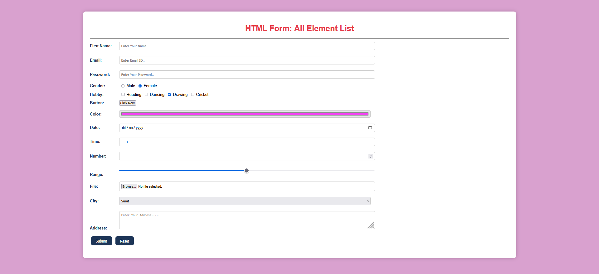

# HTML Form Practice

This project contains a styled HTML form that demonstrates the use of all common form elements in HTML5.

## 🚀 Features

- Text, Email, and Password inputs
- Radio buttons for gender
- Checkboxes for hobbies
- Color, Date, Time, Number, and Range inputs
- File upload
- Dropdown (Select) menu
- Textarea for address
- Submit and Reset buttons
- Fully responsive and styled using CSS

## 📁 File Structure

- `index.html` — Main HTML form file
- `style` — Inline CSS used for styling (within `<style>` tag)

## 📸 Preview

 

## 💡 Usage

Open `index.html` in your browser to view and interact with the form.

## 🛠️ Tech Used

- HTML5
- CSS3 (Inline)

---

